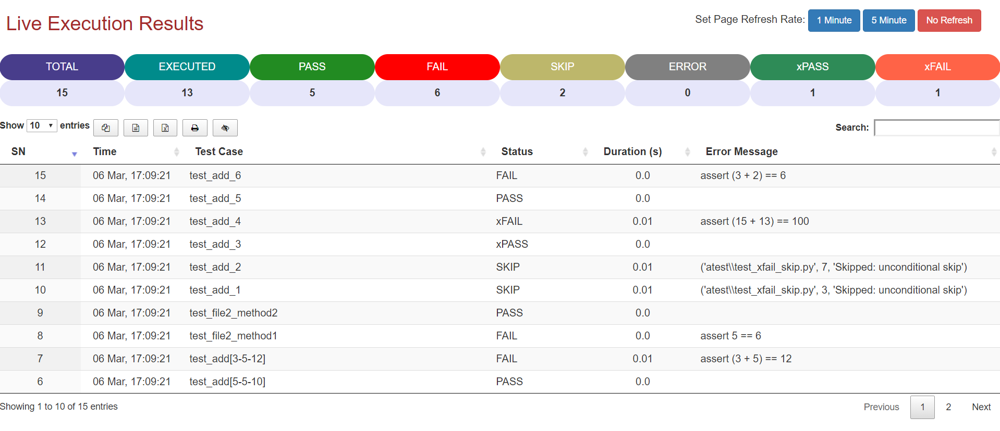

# pytest-live-results


Plugin to create live results for pytest.

[](https://badge.fury.io/py/pytest-live)
[](https://pepy.tech/project/pytest-live)
[]()
[]()
[]()

---

### How it works:

 - Get execution details using `hooks`
 - Open browser with live results
 - Updates report based on refresh rate selction

 **Note:** User can specify refresh time in page i.e., `1` or `5` minutes or can turnoff refresh

---

### How to use in project:

1. Install `pytest-live-results`

   > Case 1: Using pip
   ```
   pip install pytest-live
   ```

   > Case 2: Using `setup.py` (clone repo and run command in root)
   ```
   python setup.py install
   ```

   > Case 3: Install from git (changes in master)
   ```
   pip install git+https://github.com/adiralashiva8/pytest-live-results
   ```

3. Execute test case by enabling live logs
    ```
    pytest --live=True
    ```
    > Default --live=False

---

*Appending Timestamp to report name*

 - User can append timestamp to the name of live report (Ex: pytest_live_dd_MMM_yy_hh_mm_ss) using following command.
   ```
   pytest --live=True --livetimestamp=True
   ```
   > Default --livetimestamp=False
---

*SAMPLE REPORT*



---

*Thanks for using pytest-live-result!*

If you have any questions / suggestions / comments on this, please feel free to reach me at

 - Email: <a href="mailto:adiralashiva8@gmail.com?Subject=Pytest%20Live" target="_blank">`adiralashiva8@gmail.com`</a> 
 - LinkedIn: <a href="https://www.linkedin.com/in/shivaprasadadirala/" target="_blank">`shivaprasadadirala`</a>
 - Twitter: <a href="https://twitter.com/ShivaAdirala" target="_blank">`@ShivaAdirala`</a>

---

*Credits*

 - [Pytest-dev](https://github.com/pytest-dev)
 - [Stackoverflow](https://stackoverflow.com/questions/tagged/pytest)
 - [Datatable](https://datatables.net)
 - [pytest-community]()

---
*Special Thanks To*


*Feedback & Suggestions*

 - [Rahul Parwal](https://www.linkedin.com/in/rahul-parwal/)

---

 :star: repo if you like it
